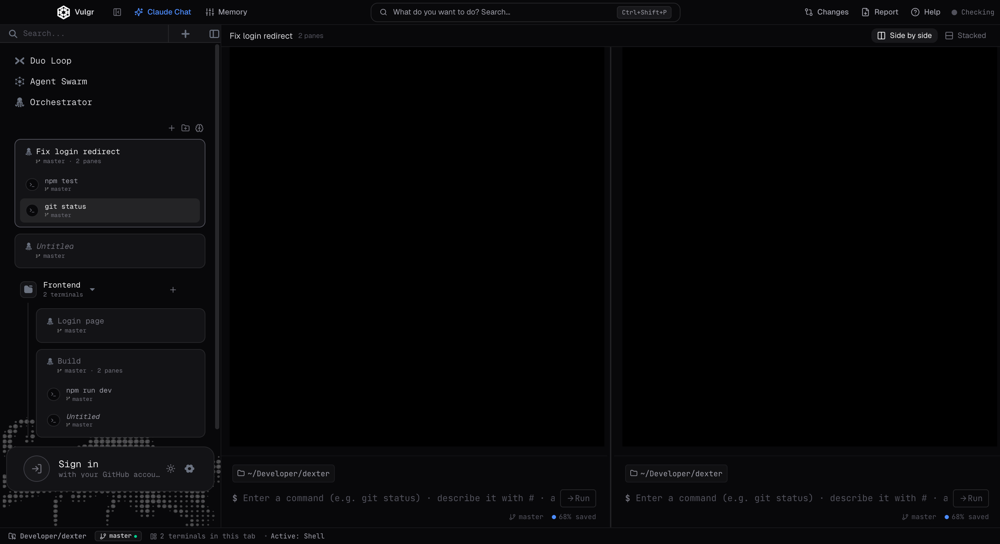

<p align="center">
  
</p>

<h1 align="center">Vulgr</h1>

<p align="center">
  An open-source terminal for working with AI coding agents.<br />
  Run Claude Code, Codex and AGY side by side, keep your sessions organized, and let agents check each other's work.
</p>

<p align="center">
  <a href="https://vulgr.tech">vulgr.tech</a> ·
  <a href="https://github.com/vulgrs/vulgr/issues">Issues</a> ·
  <a href="LICENSE">MIT License</a>
</p>

<p align="center">
  
</p>

## Download

Grab the latest build from [Releases](https://github.com/vulgrs/vulgr/releases): `Vulgr-<version>-arm64.dmg` (Apple Silicon), `Vulgr-<version>-x64.dmg` (Intel Mac) or `Vulgr-Setup-<version>.exe` (Windows). Beta builds are not code-signed yet — on macOS, right-click the app and choose **Open** the first time; on Windows, choose **More info → Run anyway**.

## Features

- **Real terminals** — xterm.js + node-pty, so agent TUIs, colors and prompts work as they do in your normal terminal.
- **Split panes** — open terminals side by side or stacked; every pane has its own command box.
- **Sessions and groups** — tabs name themselves after the work done in them (or stay *Untitled*), can be renamed, dragged into groups, and are restored on the next launch. Split tabs list their panes in the sidebar.
- **Command box** — run commands as blocks with duration and output, describe a command in plain words with `#`, or ask Claude with `?` / `Ctrl+Shift+Enter`.
- **Agents working together**
  - **Duo Loop** — one agent writes the code, another runs your tests and asks for fixes until they pass.
  - **Agent Swarm** — give one goal; writer, checker and auditor agents run it in the background, optionally in an isolated git worktree.
  - **Claude Chat** — talk to Claude Code and watch its file changes live.
- **Changes, report, memory** — review the diff and commit & push, export the session as Markdown/HTML/JSON, and keep project rules the agents always receive.
- **GitHub sign-in**, **dark / light theme**, **English / Turkish** interface.

## Requirements

- macOS or Windows (Linux should work but is not tested yet)
- [Node.js](https://nodejs.org) 20 or newer
- Build tools for the native terminal module (`node-pty`): Xcode Command Line Tools on macOS, the "Desktop development with C++" workload on Windows
- The agent CLIs you want to use, installed and signed in: [Claude Code](https://docs.anthropic.com/en/docs/claude-code), Codex CLI, AGY / Gemini CLI

## Getting started

```bash
git clone https://github.com/vulgrs/vulgr.git
cd vulgr
npm install
npm run build      # compile the Electron main process and the UI
npm run dev:app    # start the UI dev server and the app
```

`npm run start:app` runs the last build without the dev server.

## Development

| Command | What it does |
| --- | --- |
| `npm run dev:app` | Vite dev server + Electron, with hot reload for the UI |
| `npm run build` | Type-check and build everything into `dist/` |
| `npm run dist:mac` / `npm run dist:win` | Package the app into a DMG / Windows installer under `release/` |
| `npm run type-check` | Type-check the main process and the UI |
| `npm test` | Run the engine tests (after `npm run build`) |

Project layout:

- `electron/` — main process: windows, terminals (`ptyManager.ts`), GitHub sign-in, IPC
- `src/` — engine shared by the app: agent adapters, Agent Swarm (`engine/agentMesh.ts`), git and worktree helpers, tests
- `ui/` — React interface; translations live in `ui/src/i18n/messages/`

## Contributing

Issues and pull requests are welcome. For larger changes, please open an issue first so we can agree on the approach. When adding interface text, add it to both the English and Turkish tables in `ui/src/i18n/messages/` — the type-check fails if one is missing.

## License

[MIT](LICENSE) © Vulgr contributors
